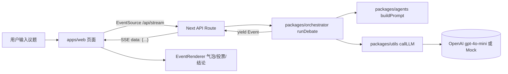

## 架构总览



Async Generator 从 `runDebate` 中逐条 `yield` 事件，Route 在 `for await` 中写入 SSE 响应流，前端 `useEventStream` 用 EventSource 消费并按 `event.type` 分发渲染。

## 目录结构

```
multi_llm_cartoon/
├── package.json              # root, pnpm workspace 配置
├── pnpm-workspace.yaml
├── tsconfig.base.json
├── .env.example              # OPENAI_API_KEY
├── apps/
│   └── web/                  # Next.js App Router (含 API Route)
│       ├── app/
│       │   ├── page.tsx      # 主页：输入框 + Scene + AgentList + EventFeed
│       │   ├── api/stream/route.ts  # SSE 接口
│       │   └── layout.tsx
│       ├── hooks/useEventStream.ts
│       ├── components/{Scene,AgentList,EventFeed,EventRenderer}.tsx
│       └── package.json
└── packages/
    ├── core/                 # Event 类型定义
    ├── agents/               # Agent 列表 + buildPrompt
    ├── utils/                # callLLM (OpenAI + mock fallback)
    └── orchestrator/         # runDebate async generator
```

## 各模块关键实现

### `packages/core` — 事件 Schema
- 导出 `EventType` 联合（`scene.init` / `agent.think` / `agent.speak` / `agent.interrupt` / `vote` / `decision.final`）
- 导出 `BaseEvent` 与各专属事件类型（如 `AgentSpeakEvent` 带 `content` + `stance: "support"|"oppose"|"neutral"`）
- 导出 `AnyEvent` 判别联合类型，供前后端共用
- 提供一个 `makeEvent<T>()` 工具函数统一生成 `id`（`crypto.randomUUID()`）+ `timestamp`

### `packages/agents` — 角色定义
- `agents.ts`：至少 3 个差异化 agent（满足验收标准），如三省六部精简为吏部/户部/兵部，每个有 `id`、`name`、`personality`、`bias`、`authority`
- `buildPrompt.ts`：`buildPrompt(agent, { topic, previousSpeeches })` 返回 prompt 字符串，强调角色 + bias + "输出不超过 80 字、必须带明确立场"

### `packages/utils` — LLM 封装
- `callLLM(prompt: string): Promise<string>`：用 `openai` 官方 SDK 调 `gpt-4o-mini`
- 若环境变量缺失或调用失败，回退到 `mockLLM(prompt)`：基于 prompt 里的 agent 名称返回预设短句，保证 demo 可跑
- 同时导出一个 `callLLMStance` 辅助（或由 orchestrator 简单解析），从返回文本中抽出 `support/oppose/neutral`（MVP 用关键词匹配即可）

### `packages/orchestrator` — 调度核心
- `async function* runDebate(topic: string): AsyncGenerator<AnyEvent>` 严格按以下顺序：
  1. `yield scene.init`（含 topic、参与 agents 列表）
  2. 遍历 agents：`yield agent.think` → `await callLLM(buildPrompt(...))` → `yield agent.speak`（同时把内容 push 到 `previousSpeeches` 供后续 agent 参考）
  3. `yield vote`（MVP：统计各 agent speak 的 stance）
  4. `yield decision.final`（按多数 stance 输出结论文本）
- 不返回数组；每条事件都独立 yield。保留扩展空间（打断、权重）但 MVP 不实现。

### `apps/web/app/api/stream/route.ts` — SSE 接口
- `GET /api/stream?topic=xxx`
- 使用 Web Streams API（Next.js App Router 原生支持）：
  ```
  const stream = new ReadableStream({
    async start(controller) {
      for await (const ev of runDebate(topic)) {
        controller.enqueue(`data: ${JSON.stringify(ev)}\n\n`)
      }
      controller.close()
    }
  })
  return new Response(stream, { headers: { 'Content-Type': 'text/event-stream', 'Cache-Control': 'no-cache', 'Connection': 'keep-alive' } })
  ```
- 导出 `export const runtime = 'nodejs'`（OpenAI SDK 依赖）、`export const dynamic = 'force-dynamic'`

### `apps/web` 前端
- `useEventStream(topic)` hook：接到 topic 时 `new EventSource('/api/stream?topic=' + encodeURIComponent(topic))`，`onmessage` push 到 `events` state，结束或报错时 close
- `page.tsx`：顶部输入框 + "开始辩论" 按钮；点击后触发 hook，渲染 `<Scene>`（显示当前高亮发言人）+ `<AgentList>`（所有 agent 头像/名称）+ `<EventFeed>`（按时间顺序的事件流）
- `EventRenderer`：`switch(event.type)` 分发——`agent.speak` 渲染气泡（左/右/颜色按 `stance`）、`vote` 渲染简单结果条、`decision.final` 渲染加粗结论框；当前说话者用 CSS 高亮 + 逐字动画（CSS transition 或简单 `setInterval` 即可，不引入 framer-motion 除非必要）

## 开发顺序（严格按文档第九节）

1. 初始化 monorepo（root `package.json`、`pnpm-workspace.yaml`、共享 `tsconfig.base.json`）
2. `packages/core` → 类型先行
3. `packages/utils` + `packages/agents` → LLM 与角色
4. `packages/orchestrator` → 用 mock LLM 先跑通 yield 流程（可写一个 `pnpm --filter orchestrator dev` 的临时 CLI 打印事件验证）
5. `apps/web` Next 项目 + `/api/stream` route
6. 前端 hook + 组件 + 基础样式（Tailwind 或裸 CSS，MVP 用裸 CSS Module 即可，避免装多余依赖）
7. 冒烟联调：`pnpm dev` → 浏览器输入议题 → 看到完整事件流

## 环境与脚本

- 根 `package.json` 脚本：`dev`（`pnpm --filter web dev`）、`build`、`lint`
- `.env.example` 含 `OPENAI_API_KEY=`（留空时自动走 mock）
- `README.md`（按 `making_code_changes` 要求补一个简短的启动说明）

## 风险与取舍

- **不用 Turborepo**：MVP 体量小，pnpm workspace 足够；后续扩展再加。
- **不用 framer-motion**：文档标为"可选"；用 CSS 过渡即可满足"流式展示"。
- **stance 解析简易**：MVP 用关键字匹配或让 LLM 返回结构化 `支持/反对/中立: ...` 前缀；后续可换 JSON mode。
- **没有 apps/server 目录**：已与用户确认，用 Next API Route 替代，以减少进程数和 CORS 复杂度。